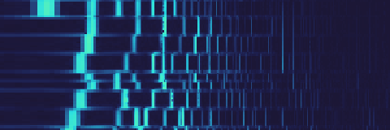

<h1>
x-spectrogram <a href="https://npmjs.org/package/x-spectrogram"></a> <a href="src"></a> <a href="https://cdn.jsdelivr.net/npm/x-spectrogram@2.0.0/dist/x-spectrogram.min.js"></a> <a href="LICENSE"></a>
</h1>

<p></p>

Audio spectrogram Web Component.

<h4>
<table><tr><td title="Triple click to select and copy paste">
<code>npm i x-spectrogram </code>
</td><td title="Triple click to select and copy paste">
<code>pnpm add x-spectrogram </code>
</td><td title="Triple click to select and copy paste">
<code>yarn add x-spectrogram</code>
</td></tr></table>
</h4>

## Examples

<details id="example$web" title="web" open><summary><span><a href="#example$web">#</a></span>  <code><strong>web</strong></code></summary>  <ul><p></p>  <a href="https://stagas.github.io/x-spectrogram/example/web.html"></img>  <p><strong>Try it live</strong></p></a>    <details id="source$web" title="web source code" ><summary><span><a href="#source$web">#</a></span>  <code><strong>view source</strong></code></summary>  <a href="example/web.ts">example/web.ts</a>  <p>

```ts
import { fetchAudioBuffer } from 'webaudio-tools'
import { SpectrogramElement } from 'x-spectrogram/dist/esm'

customElements.define('x-spectrogram', SpectrogramElement)
document.body.innerHTML = `
<div id="demo" style="display:inline-flex;height:80px;">
  <x-spectrogram autoresize></x-spectrogram>
</div>
`

const ctx = new AudioContext({ sampleRate: 44100, latencyHint: 'playback' })

const analyser = ctx.createAnalyser()
analyser.fftSize = 4096
analyser.smoothingTimeConstant = 0
analyser.maxDecibels = 0
analyser.minDecibels = -100

// @ts-ignore
const url = new URL('alpha_molecule.ogg', import.meta.url).toString()

fetchAudioBuffer(ctx, url).then(audioBuffer => {
  const source = ctx.createBufferSource()
  source.buffer = audioBuffer
  source.loop = true
  source.connect(ctx.destination)
  source.start(0, 30)
  source.connect(analyser)
  ;(document.querySelector('x-spectrogram') as SpectrogramElement).analyser =
    analyser
})

window.onclick = () => ctx.state !== 'running' ? ctx.resume() : ctx.suspend()
if (ctx.state !== 'running')
  document.body.appendChild(new Text('click to start/stop'))
```

</p>
</details></ul></details>

## API

<p>  <details id="SpectrogramElement$1" title="Class" open><summary><span><a href="#SpectrogramElement$1">#</a></span>  <code><strong>SpectrogramElement</strong></code>    </summary>  <a href="src/x-spectrogram.ts#L29">src/x-spectrogram.ts#L29</a>  <ul>        <p>  <details id="constructor$2" title="Constructor" ><summary><span><a href="#constructor$2">#</a></span>  <code><strong>constructor</strong></code><em>()</em>    </summary>    <ul>    <p>  <details id="new SpectrogramElement$3" title="ConstructorSignature" ><summary><span><a href="#new SpectrogramElement$3">#</a></span>  <code><strong>new SpectrogramElement</strong></code><em>()</em>    </summary>    <ul><p><a href="#SpectrogramElement$1">SpectrogramElement</a></p>        </ul></details></p>    </ul></details><details id="analyser$16" title="Property" ><summary><span><a href="#analyser$16">#</a></span>  <code><strong>analyser</strong></code>    </summary>  <a href="src/x-spectrogram.ts#L49">src/x-spectrogram.ts#L49</a>  <ul><p><span>AnalyserNode</span></p>        </ul></details><details id="analyserData$17" title="Property" ><summary><span><a href="#analyserData$17">#</a></span>  <code><strong>analyserData</strong></code>  <span><span>&nbsp;=&nbsp;</span>  <code>...</code></span>  </summary>  <a href="src/x-spectrogram.ts#L50">src/x-spectrogram.ts#L50</a>  <ul><p><span>Float32Array</span></p>        </ul></details><details id="autoResize$5" title="Property" ><summary><span><a href="#autoResize$5">#</a></span>  <code><strong>autoResize</strong></code>  <span><span>&nbsp;=&nbsp;</span>  <code>false</code></span>  </summary>  <a href="src/x-spectrogram.ts#L32">src/x-spectrogram.ts#L32</a>  <ul><p>boolean</p>        </ul></details><details id="background$9" title="Property" ><summary><span><a href="#background$9">#</a></span>  <code><strong>background</strong></code>  <span><span>&nbsp;=&nbsp;</span>  <code>'#123'</code></span>  </summary>  <a href="src/x-spectrogram.ts#L38">src/x-spectrogram.ts#L38</a>  <ul><p>string</p>        </ul></details><details id="canvas$25" title="Property" ><summary><span><a href="#canvas$25">#</a></span>  <code><strong>canvas</strong></code>    </summary>  <a href="src/x-spectrogram.ts#L53">src/x-spectrogram.ts#L53</a>  <ul><p><span>HTMLCanvasElement</span></p>        </ul></details><details id="color$10" title="Property" ><summary><span><a href="#color$10">#</a></span>  <code><strong>color</strong></code>  <span><span>&nbsp;=&nbsp;</span>  <code>'#1ff'</code></span>  </summary>  <a href="src/x-spectrogram.ts#L39">src/x-spectrogram.ts#L39</a>  <ul><p>string</p>        </ul></details><details id="destroy$39" title="Property" ><summary><span><a href="#destroy$39">#</a></span>  <code><strong>destroy</strong></code>  <span><span>&nbsp;=&nbsp;</span>  <code>...</code></span>  </summary>  <a href="src/x-spectrogram.ts#L76">src/x-spectrogram.ts#L76</a>  <ul><p><details id="__type$40" title="Function" ><summary><span><a href="#__type$40">#</a></span>  <em>()</em>    </summary>    <ul>    <p>      <p><strong></strong><em>()</em>  &nbsp;=&gt;  <ul>void</ul></p></p>    </ul></details></p>        </ul></details><details id="draw$26" title="Property" ><summary><span><a href="#draw$26">#</a></span>  <code><strong>draw</strong></code>    </summary>  <a href="src/x-spectrogram.ts#L58">src/x-spectrogram.ts#L58</a>  <ul><p><details id="__type$27" title="Function" ><summary><span><a href="#__type$27">#</a></span>  <em>()</em>    </summary>    <ul>    <p>      <p><strong></strong><em>()</em>  &nbsp;=&gt;  <ul>void</ul></p></p>    </ul></details></p>        </ul></details><details id="getFFTLogIndex$18" title="Property" ><summary><span><a href="#getFFTLogIndex$18">#</a></span>  <code><strong>getFFTLogIndex</strong></code>    </summary>  <a href="src/x-spectrogram.ts#L51">src/x-spectrogram.ts#L51</a>  <ul><p><details id="__type$19" title="Function" ><summary><span><a href="#__type$19">#</a></span>  <em>(normal)</em>    </summary>    <ul>    <p>    <details id="normal$21" title="Parameter" ><summary><span><a href="#normal$21">#</a></span>  <code><strong>normal</strong></code>    </summary>    <ul><p>number</p>        </ul></details>  <p><strong></strong><em>(normal)</em>  &nbsp;=&gt;  <ul>number</ul></p></p>    </ul></details></p>        </ul></details><details id="height$8" title="Property" ><summary><span><a href="#height$8">#</a></span>  <code><strong>height</strong></code>  <span><span>&nbsp;=&nbsp;</span>  <code>50</code></span>  </summary>  <a href="src/x-spectrogram.ts#L36">src/x-spectrogram.ts#L36</a>  <ul><p>number</p>        </ul></details><details id="loop$29" title="Property" ><summary><span><a href="#loop$29">#</a></span>  <code><strong>loop</strong></code>    </summary>  <a href="src/x-spectrogram.ts#L59">src/x-spectrogram.ts#L59</a>  <ul><p>{<p>  <details id="start$31" title="Method" ><summary><span><a href="#start$31">#</a></span>  <code><strong>start</strong></code><em>()</em>    </summary>    <ul>    <p>      <p><strong>start</strong><em>()</em>  &nbsp;=&gt;  <ul>void</ul></p></p>    </ul></details><details id="stop$33" title="Method" ><summary><span><a href="#stop$33">#</a></span>  <code><strong>stop</strong></code><em>()</em>    </summary>    <ul>    <p>      <p><strong>stop</strong><em>()</em>  &nbsp;=&gt;  <ul>void</ul></p></p>    </ul></details></p>}</p>        </ul></details><details id="maxFreq$12" title="Property" ><summary><span><a href="#maxFreq$12">#</a></span>  <code><strong>maxFreq</strong></code>  <span><span>&nbsp;=&nbsp;</span>  <code>21000</code></span>  </summary>  <a href="src/x-spectrogram.ts#L42">src/x-spectrogram.ts#L42</a>  <ul><p>number</p>        </ul></details><details id="minFreq$11" title="Property" ><summary><span><a href="#minFreq$11">#</a></span>  <code><strong>minFreq</strong></code>  <span><span>&nbsp;=&nbsp;</span>  <code>62</code></span>  </summary>  <a href="src/x-spectrogram.ts#L41">src/x-spectrogram.ts#L41</a>  <ul><p>number</p>        </ul></details><details id="onmounted$54" title="Property" ><summary><span><a href="#onmounted$54">#</a></span>  <code><strong>onmounted</strong></code>    </summary>    <ul><p><span>EventHandler</span>&lt;<a href="#SpectrogramElement$1">SpectrogramElement</a>, <span>CustomEvent</span>&lt;any&gt;&gt;</p>        </ul></details><details id="onunmounted$55" title="Property" ><summary><span><a href="#onunmounted$55">#</a></span>  <code><strong>onunmounted</strong></code>    </summary>    <ul><p><span>EventHandler</span>&lt;<a href="#SpectrogramElement$1">SpectrogramElement</a>, <span>CustomEvent</span>&lt;any&gt;&gt;</p>        </ul></details><details id="pixelRatio$6" title="Property" ><summary><span><a href="#pixelRatio$6">#</a></span>  <code><strong>pixelRatio</strong></code>  <span><span>&nbsp;=&nbsp;</span>  <code>window.devicePixelRatio</code></span>  </summary>  <a href="src/x-spectrogram.ts#L33">src/x-spectrogram.ts#L33</a>  <ul><p>number</p>        </ul></details><details id="renderNextAnimFrame$22" title="Property" ><summary><span><a href="#renderNextAnimFrame$22">#</a></span>  <code><strong>renderNextAnimFrame</strong></code>    </summary>  <a href="src/x-spectrogram.ts#L52">src/x-spectrogram.ts#L52</a>  <ul><p><details id="__type$23" title="Function" ><summary><span><a href="#__type$23">#</a></span>  <em>()</em>    </summary>    <ul>    <p>      <p><strong></strong><em>()</em>  &nbsp;=&gt;  <ul>void</ul></p></p>    </ul></details></p>        </ul></details><details id="root$4" title="Property" ><summary><span><a href="#root$4">#</a></span>  <code><strong>root</strong></code>  <span><span>&nbsp;=&nbsp;</span>  <code>...</code></span>  </summary>  <a href="src/x-spectrogram.ts#L30">src/x-spectrogram.ts#L30</a>  <ul><p><span>ShadowRoot</span></p>        </ul></details><details id="width$7" title="Property" ><summary><span><a href="#width$7">#</a></span>  <code><strong>width</strong></code>  <span><span>&nbsp;=&nbsp;</span>  <code>150</code></span>  </summary>  <a href="src/x-spectrogram.ts#L35">src/x-spectrogram.ts#L35</a>  <ul><p>number</p>        </ul></details><details id="worker$14" title="Property" ><summary><span><a href="#worker$14">#</a></span>  <code><strong>worker</strong></code>  <span><span>&nbsp;=&nbsp;</span>  <code>...</code></span>  </summary>  <a href="src/x-spectrogram.ts#L46">src/x-spectrogram.ts#L46</a>  <ul><p><code>null</code> | <span>Worker</span></p>        </ul></details><details id="workerData$15" title="Property" ><summary><span><a href="#workerData$15">#</a></span>  <code><strong>workerData</strong></code>    </summary>  <a href="src/x-spectrogram.ts#L47">src/x-spectrogram.ts#L47</a>  <ul><p><span>Float32Array</span></p>        </ul></details><details id="workerUrl$13" title="Property" ><summary><span><a href="#workerUrl$13">#</a></span>  <code><strong>workerUrl</strong></code>  <span><span>&nbsp;=&nbsp;</span>  <code>...</code></span>  </summary>  <a href="src/x-spectrogram.ts#L45">src/x-spectrogram.ts#L45</a>  <ul><p>string</p>        </ul></details><details id="mounted$42" title="Method" ><summary><span><a href="#mounted$42">#</a></span>  <code><strong>mounted</strong></code><em>($)</em>    </summary>  <a href="src/x-spectrogram.ts#L78">src/x-spectrogram.ts#L78</a>  <ul>    <p>    <details id="$$44" title="Parameter" ><summary><span><a href="#$$44">#</a></span>  <code><strong>$</strong></code>    </summary>    <ul><p><span>Context</span>&lt;<a href="#SpectrogramElement$1">SpectrogramElement</a> &amp; <span>JsxContext</span>&lt;<a href="#SpectrogramElement$1">SpectrogramElement</a>&gt; &amp; <span>Omit</span>&lt;{<p>    <details id="ctor$48" title="Parameter" ><summary><span><a href="#ctor$48">#</a></span>  <code><strong>ctor</strong></code>    </summary>    <ul><p><span>Class</span>&lt;<a href="#T$47">T</a>&gt;</p>        </ul></details>  <p><strong></strong>&lt;<span>T</span>&gt;<em>(ctor)</em>  &nbsp;=&gt;  <ul><span>CleanClass</span>&lt;<a href="#T$47">T</a>&gt;</ul></p>  <details id="ctx$52" title="Parameter" ><summary><span><a href="#ctx$52">#</a></span>  <code><strong>ctx</strong></code>    </summary>    <ul><p><a href="#T$51">T</a> | <span>Class</span>&lt;<a href="#T$51">T</a>&gt;</p>        </ul></details>  <p><strong></strong>&lt;<span>T</span>&gt;<em>(ctx)</em>  &nbsp;=&gt;  <ul><span>Wrapper</span>&lt;<a href="#T$51">T</a>&gt;</ul></p></p>} &amp; <span>__module</span> &amp; {}, <code>"transition"</code>&gt;&gt;</p>        </ul></details>  <p><strong>mounted</strong><em>($)</em>  &nbsp;=&gt;  <ul>void</ul></p></p>    </ul></details><details id="start$35" title="Method" ><summary><span><a href="#start$35">#</a></span>  <code><strong>start</strong></code><em>()</em>     &ndash; Start displaying the spectrum.</summary>  <a href="src/x-spectrogram.ts#L66">src/x-spectrogram.ts#L66</a>  <ul>    <p>      <p><strong>start</strong><em>()</em>  &nbsp;=&gt;  <ul>void</ul></p></p>    </ul></details><details id="stop$37" title="Method" ><summary><span><a href="#stop$37">#</a></span>  <code><strong>stop</strong></code><em>()</em>     &ndash; Stop displaying the spectrum.</summary>  <a href="src/x-spectrogram.ts#L72">src/x-spectrogram.ts#L72</a>  <ul>    <p>      <p><strong>stop</strong><em>()</em>  &nbsp;=&gt;  <ul>void</ul></p></p>    </ul></details></p></ul></details></p>

## Credits

- [sigl](https://npmjs.org/package/sigl) by [stagas](https://github.com/stagas) &ndash; Web framework
- [webaudio-tools](https://npmjs.org/package/webaudio-tools) by [stagas](https://github.com/stagas) &ndash; Useful tools for WebAudio.

## Contributing

[Fork](https://github.com/stagas/x-spectrogram/fork) or [edit](https://github.dev/stagas/x-spectrogram) and submit a PR.

All contributions are welcome!

## License

<a href="LICENSE">MIT</a> &copy; 2022 [stagas](https://github.com/stagas)
